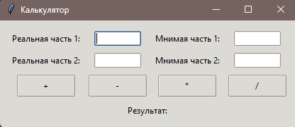

# Калькулятор



Для использования этого приложения у вас должен быть установлен Python. Это приложение было разработано и 
протестировано с использованием Python версии 3.12.

Перед запуском приложения убедитесь, что на вашем компьютере установлены следующие компоненты:

- Python (3.8 или выше)
- Tkinter (обычно поставляется вместе с Python)
- logging (pip install logger)

### Установка

Для запуска приложения необходимо скачать исходный код.

1. Клонируйте репозиторий с GitHub:

   ```bash
   git clone https://github.com/marcusjur/calculator.git
   ```

### Запуск приложения

```bash
python app.py
```